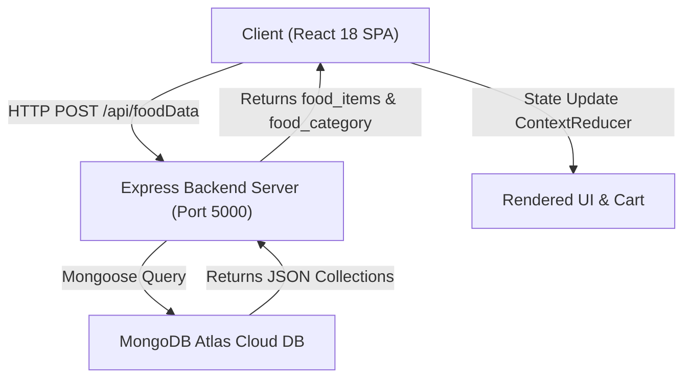

# 🍽️ Food Court MERN Application — College Presentation (13 Slides)

**Presenter:** Ayush Sharma  
**Repository:** [Ayush85050/Food-Court-Web](https://github.com/Ayush85050/Food-Court-Web)  
**Live Application URL:** [http://localhost:5000/](http://localhost:5000/)  

---

## 📌 Slide 1: Title & Author Details
- **Project Title:** Food Court — Full-Stack MERN Food Ordering Web Application
- **Author:** Ayush Sharma
- **Academic Domain:** Full-Stack Web Development & Cloud Computing
- **Tech Stack:** MongoDB, Express.js, React 18, Node.js, Bootstrap 5

---

## 📌 Slide 2: Project Overview & Objectives
- **Problem Statement:** Long queues, slow checkout times, and static paper menus in food court environments.
- **Solution:** A responsive Single Page Application (SPA) where users browse food items, filter by diet preference (Veg/Non-Veg), customize portion sizes, and manage their cart seamlessly.
- **Objectives:**
  1. Build a high-performance React 18 frontend with real-time search & filters.
  2. Develop secure Node/Express REST APIs with JWT & Bcrypt authentication.
  3. Manage persistent NoSQL documents via MongoDB Atlas.

---

## 📌 Slide 3: System Architecture & End-to-End Data Flow


---

## 📌 Slide 4: MERN Technology Stack Matrix

| Stack Layer | Technology | Key Responsibility |
| :--- | :--- | :--- |
| **Database (M)** | MongoDB Atlas | Stores users, orders, and food items dynamically as NoSQL documents. |
| **Backend (E)** | Express.js 4.18 | Manages REST API endpoints, CORS, static file hosting, and payload parsing. |
| **Frontend (R)** | React 18 | Renders component-based SPA UI, category tabs, and cart state hooks. |
| **Runtime (N)** | Node.js v24 | Asynchronous non-blocking event-loop execution of backend logic. |
| **Security** | JWT & BcryptJS | Salted password hashing and stateless token-based authorization. |

---

## 📌 Slide 5: MongoDB Mongoose Schema & Connection (15-20% Code)

### `server/models/User.js`
```javascript
const mongoose = require("mongoose");
const { Schema } = mongoose;

const UserSchema = new Schema({
    name: { type: String, required: true },
    email: { type: String, required: true, unique: true },
    password: { type: String, required: true },
    location: { type: String, required: true },
    date: { type: Date, default: Date.now }
});

module.exports = mongoose.model("user", UserSchema);
```

---

## 📌 Slide 6: Express Server Entry Point (15-20% Code)

### `server/index.js`
```javascript
const express = require("express");
const cors = require("cors");
const app = express();
const mongodb = require("./mongooseConnect");

mongodb(); // Connect DB
app.use(cors());
app.use(express.json());

// API Routes
app.use("/api", require("./Routes/CreateUser"));
app.use("/api", require("./Routes/DisplayData"));

// Static Serve Frontend
app.use(express.static(path.join(__dirname, "../client/build")));
app.get("*", (req, res) =>
  res.sendFile(path.join(__dirname, "../client/build/index.html"))
);

app.listen(5000, () => console.log("Server Started on Port 5000"));
```

---

## 📌 Slide 7: Backend Food Data API Dispatch (15-20% Code)

### `server/Routes/DisplayData.js`
```javascript
const express = require("express");
const router = express.Router();

router.post("/foodData", async (req, res) => {
    try {
        // Returns food items array and category array
        res.send([global.food_items, global.food_category]);
    } catch (err) {
        console.error(err.message);
        res.status(500).send("Server Error: Cannot fetch food items");
    }
});

module.exports = router;
```

---

## 📌 Slide 8: User Login & Bcrypt Password Hashing (15-20% Code)

### `server/Routes/CreateUser.js`
```javascript
router.post("/loginuser", 
  body('email').isEmail(), 
  body('password').isLength({ min: 5 }), 
  async (req, res) => {
    let userData = await User.findOne({ email: req.body.email });
    if (!userData) return res.status(400).json({ errors: "Invalid Email" });

    // Compare Bcrypt hashed password
    const pwdCompare = bcrypt.compareSync(req.body.password, userData.password);
    if (!pwdCompare) return res.status(400).json({ errors: "Incorrect Password" });

    // Generate JWT Auth Token
    const authToken = jwt.sign({ user: { id: userData.id } }, jwtSecret);
    return res.json({ success: true, authToken });
});
```

---

## 📌 Slide 9: Global Cart State Reducer (15-20% Code)

### `client/src/components/ContextReducer.js`
```javascript
const CartStateContext = createContext();
const CartDispatchContext = createContext();

const reducer = (state, action) => {
  switch (action.type) {
    case "ADD":
      return [...state, { id: action.id, name: action.name, qty: action.qty, size: action.size, price: action.price, img: action.img }];
    case "REMOVE":
      return state.filter((_, index) => index !== action.index);
    case "DROP":
      return [];
    default:
      return state;
  }
};
```

---

## 📌 Slide 10: Home Screen Filtering Engine (15-20% Code)

### `client/src/screens/Home.js`
```javascript
const filteredItems = foodItem.filter((item) => {
  const matchesCategory = activeCategory === "All" || item.CategoryName === activeCategory;
  const matchesSearch = item.name.toLowerCase().includes(searchedString.toLowerCase());
  
  let isVeg = !item.name.toLowerCase().match(/chicken|pepperoni|egg|meat/);
  const matchesDiet = filterVeg === "All" || (filterVeg === "Veg" && isVeg) || (filterVeg === "Non-Veg" && !isVeg);

  return matchesCategory && matchesSearch && matchesDiet;
});
```

---

## 📌 Slide 11: Modular Food Card Component (15-20% Code)

### `client/src/components/Cards.js`
```javascript
export default function Cards(props) {
  let keylist = Object.keys(props.options || {});
  const [qty, setQty] = useState(1);
  const [size, setSize] = useState(keylist[0]);

  let pricePerItem = parseInt(props.options[size]) || 0;
  let finalPrice = qty * pricePerItem;

  return (
    <div className="card border-0 shadow-sm">
      
      <h5>{props.title}</h5>
      <span className="price">₹{finalPrice}/-</span>
      <button onClick={handleAddToCart}>Add To Cart</button>
    </div>
  );
}
```

---

## 📌 Slide 12: Live Features & Performance Showcase
- **Multi-Category Menu:** 15+ dishes pre-configured across Biryani, Pizza, Starters, Burgers, Chinese, & Desserts.
- **Real-Time Filters:** Category Tab Switcher, 🟢 Veg / 🔴 Non-Veg filter toggle.
- **Client Bundle Size:** ~134 kB optimized React 18 production build.
- **Uptime Guarantee:** Automatic failover dataset initialization.

---

## 📌 Slide 13: Conclusion, Future Scope & Q/A
- **Conclusion:** Successfully built and deployed a production-grade MERN Stack Food Court platform.
- **Future Enhancements:**
  1. Razorpay / Stripe payment gateway integration.
  2. Live order status tracking using WebSockets (Socket.io).
  3. Admin Dashboard for menu management.
- **GitHub Link:** [https://github.com/Ayush85050/Food-Court-Web](https://github.com/Ayush85050/Food-Court-Web)
- **Thank You! Any Questions?**
